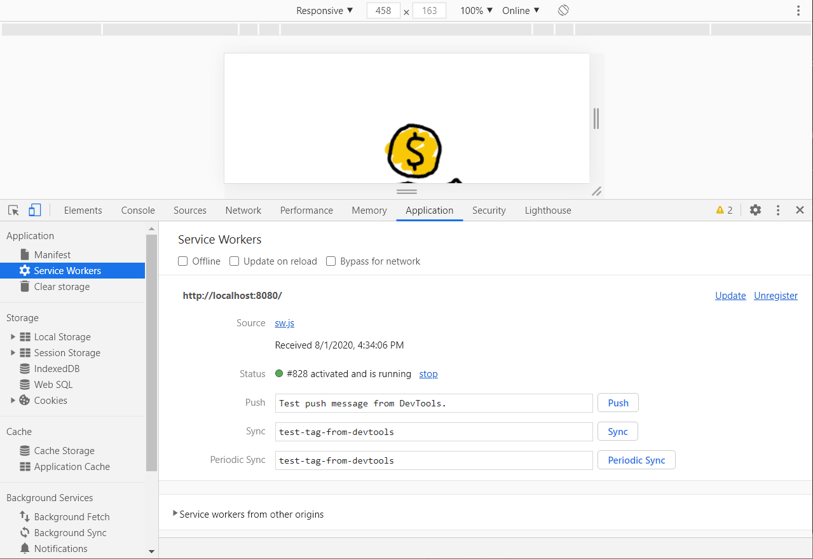
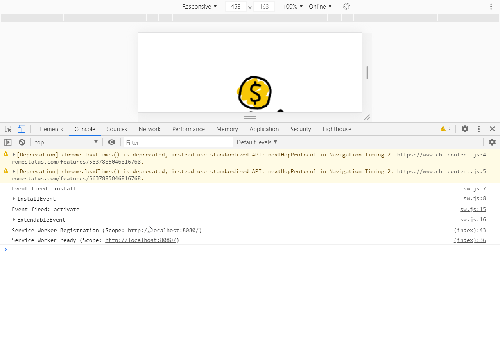

# Exercise 1 - Simple Service Worker

In this exercise, you'll add a very simple service worker to a web application. The service worker won't do much, but you'll learn how to implement the registration process and how to work with service workers in the browser's debugging tools.

**Note:** You can add the service worker to an existing web application of your own, a sample web app from the Internet, or you can use the one provided with the course materials.

## Using the Sample App Included with the Course

To use the source project included with the student files, clone this GitHub repository to your local development system by opening a terminal window or command prompt and executing the following command:

```shell
git clone https://github.com/johnwargo/pwa-starter-course
```

In the cloned repo, the sample application used for this exercise is in a folder called `exercises/01-service-workers/tip-calculator-start`, make a copy of that folder and work in the copy for this exercise.

If you run into trouble, the completed exercise is in the repo's `01-service-workers/tip-calculator-end` folder.

## Exercise Instructions

Open the project's `index.html` file and add the following code to the end of the `<head>` section of the file:

```html
<script>
  // does the browser support service workers?
  if ('serviceWorker' in navigator) {      
    // register the service worker (notice the capital W)
    navigator.serviceWorker.register('./sw.js')
      .then(function (reg) {
        console.log(`Service Worker Registration (Scope: ${reg.scope})`);
      })
      .catch(function (error) {
        // display an error message
        console.log(`Service Worker Error (${error})`);
      });
  } else {
    // happens when the app isn't served over a TLS connection (HTTPS)
    console.warn('Service Worker not available');
  }
</script>
```

This code validates that the browser supports service workers, then registers the service worker.

**Note:** You can also put this code in a separate JavaScript file and load that file from the `index.html` file. 

If you'd like to see something written to the console when the service worker activates, add the following code before the call to `navigator.serviceWorker.register`:

```javascript
// fires when the service worker is ready
navigator.serviceWorker.ready.then(reg => {
  // we have an active service worker working for us
  console.log(`Service Worker ready (Scope: ${reg.scope})`);
  // do something interesting here, if you want...

});
```

When you're done, the complete block of added code should look like the following:

```JavaScript
 <script>
    // does the browser support service workers?
    if ('serviceWorker' in navigator) {
      // fires when the service worker is ready
      navigator.serviceWorker.ready.then(reg => {
        // we have an active service worker working for us
        console.log(`Service Worker ready (Scope: ${reg.scope})`);
        // do something interesting, if you want...

      });
      // then register our service worker
      navigator.serviceWorker.register('./sw.js')
        .then(function (reg) {
          console.log(`Service Worker Registration (Scope: ${reg.scope})`);
        })
        .catch(function (error) {
          // display an error message
          console.log(`Service Worker Error (${error})`);
        });
    } else {
      // happens when the app isn't served over a TLS connection (HTTPS)
      console.warn('Service Worker not available');
    }
  </script>
```

Next lets add a service worker to the project, create a new file called `sw.js` to the project root (the folder that contains the project's `index.html` file) then add the following code to the new file:

```javascript
self.addEventListener('install', event => {
    console.log(`Event fired: ${event.type}`);
    console.dir(event);
});

self.addEventListener('activate', event => {
    console.log(`Event fired: ${event.type}`);
    console.dir(event);
});

self.addEventListener('fetch', event => {
    console.log(`Fetching ${event.request.url}`);
    // get the requested resource from the network
    event.respondWith(fetch(event.request));
});
```

The code you just added adds event listeners for the three main service worker events covered in this course.

## Testing The Code

With all of the code in place, lets test it out. 

Remember, a web app can only use a service worker if the app loads over a secure connection, or loads from the system's localhost (http://127.0.0.1). For this to work, you'll have to host the app on a server with a secure connection or on a local web server. If you have either of those options in place, go ahead and load the app in the browser from one of those server options.

Another option is to run a local web server on [Node.js](https://nodejs.org). using [http-server](https://www.npmjs.com/package/http-server). If you don't have Node installed, go ahead and install it. With Node installed, install the `http-server` task by opening a command prompt or terminal window and executing the following command:

```shell
npm install -g http-server
```

When the module installs correctly, navigate to the project folder for this exercise and execute the following command:

```shell
http-server
```

The server will load, then display the following output:

```text
Starting up http-server, serving ./
Available on:
  http://192.168.86.56:8080
  http://192.168.83.1:8080
  http://192.168.189.1:8080
  http://127.0.0.1:8080
Hit CTRL-C to stop the server
```

This means that the server is serving the current folder on port `8080`. At this point, you can open your browser of choice and navigate to `http://localhost:8080` to open the app. When the app opens, open the browser's Developer Tools then look for the Service Workers tab shown in the following figure.



If you don't see the service worker listed as shown in the figure, you have some troubleshooting to do. In many cases, the browser will display error messages here letting you know why it can't open the service worker. 

When the service worker loads correctly, switch to the console tab, you should see output similar to what's shown below:



Here you can see the install and activate events firing. Reload the page and you should see the console messages from the `fetch` event as shown in the following figure:


Notice that since the service worker is registered and activated when you reload the page, the `fetch` event is processing requests before the `index.js` file even loads.


```shell
sw.js:26 Fetching http://localhost:8080/css/normalize.css
sw.js:26 Fetching http://localhost:8080/css/main.css
sw.js:26 Fetching http://localhost:8080/js/main.js
sw.js:26 Fetching https://fonts.googleapis.com/css?family=Roboto:300,400,700&display=swap
sw.js:26 Fetching http://localhost:8080/img/tip-200.png
(index):36 Service Worker ready (Scope: http://localhost:8080/)
(index):43 Service Worker Registration (Scope: http://localhost:8080/)
sw.js:26 Fetching http://localhost:8080/favicon-32x32.png
```

