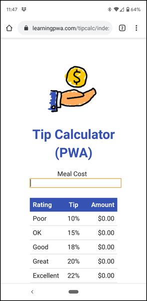

# Exercise 2 - Installable Web Application

In this exercise, you'll add a web app manifest file and some JavaScript code to a web application to make it installable.

**Note:** You can add the manifest to an existing web application of your own, a sample web app from the Internet, or you can use the one provided with the course materials.

## Using the Sample App Included with the Course

To use the source project included with the student files, clone this GitHub repository to your local development system by opening a terminal window or command prompt and executing the following command:

```shell
git clone https://github.com/johnwargo/pwa-starter-course
```

In the cloned repo, the sample application used for this exercise is in a folder called `exercises/02-installable/tip-calculator-start`, make a copy of that folder and work in the copy for this exercise. The project already includes all of the icons and other files used by the application.

If you run into trouble, the completed exercise is in the repo's `exercises/02-installable/tip-calculator-end` folder.

## Exercise Instructions

In the the project's root folder, create a new file called `app.webmanifest` then populate the file with a JSON object representing the application as shown in the following example:

```json
{
  "short_name": "",
  "name": "",
  "icons": [
    {
      "src": "icons/app_icon_192x192.png",
      "sizes": "192x192",
      "type": "image/png"
    },
    {
      "src": "icons/app_icon_512x512.png",
      "sizes": "512x512",
      "type": "image/png"
    }
  ],
  "start_url": "/index.html?source=pwa",
  "display": "",
}
```

Give the application `short_name` and/or `name` properties and set a value for the `display` property.

Save the changes to the `app.webmanifest` file.

When you have time, play around with some of the other settings in the manifest as described in [web app manifests](https://developer.mozilla.org/en-US/docs/Web/Manifest).

Next, open the project's `index.html` file and add an install button to the app's UI; add the button to the top of the file's `<body>` section.

```html
<div id='installButtonDiv'>
  <button id='installButton'>Install</button>
</div>
```

The styling for the button is already in the app's CSS, but if you're using your own web app for this exercise, you'll want to style the button appropriately. In this example, the Install button remains hidden until the app is ready to install.

Save the changes to the `index.html` file.

Now we must add code to interact with that button we just added. In the project's `js/main.js` file, add the following code:

```javascript
// get a handle to the install button
let installButton = document.getElementById('installButton');
// now set the click handler for the install button
installButton.onclick = doInstall;

// create an object we'll use to hold the reference to the PWA install
// event
let deferredPrompt;
```

This code gives the app a handle to the install button and sets the click listener for the button pointing to a function we'll add soon. The app uses the `deferredPrompt` variable to hold the browser's install event object and we'll use that soon as well.

Add an event listener for the `beforeinstallprompt` event:

```javascript
// now add an event listener to respond to the event. Right before the browser
// installs the PWA, it fires the beforeinstallprompt event. Here, we'll manage
// the installation ourselves
window.addEventListener('beforeinstallprompt', event => {
  console.log('Event: beforeinstallprompt')
  // don't allow the browser to do its install, we want to do it when the user
  // taps our install button
  event.preventDefault();
  // stash the event object so we can use it later (when the user taps the install button)
  deferredPrompt = event;
  // now unhide the Install button so the user can tap it!
  installButton.style.display = 'block';
});
```

This code handles capturing the browser-fired before installation event so we can invoke it later when the user clicks or taps our Install button. In the following line:

```javascript
event.preventDefault();
```

We're telling the browser, don't show its default Installation UI. Next, we capture the install event in:

```javascript
deferredPrompt = event;
```

We'll invoke the installation later using the `deferredPrompt` object.

Finally we unhide the Install button so the user can tap it when they want:

```javascript
installButton.style.display = 'block';
```

What you've done so far is setup the app so it can manage the installation. Next we'll add code that performs the installation when the user taps the Install button. Add the following block of code to the file:

```javascript
function doInstall() {
  console.log('doInstall');
  // we've tapped the install button, so hide it
  installButton.style.display = 'none';
  // execute the deferred installation prompt
  deferredPrompt.prompt();
  // wait for the response from the deferred prompt
  deferredPrompt.userChoice.then(res => {
    // did the user approve installation?
    if (res.outcome === 'accepted') {
      console.log('doInstall: accepted');
    } else {
      console.log('doInstall: declined');
    }
    // clear the deferred prompt object so we can only do this once
    deferredPrompt = null;
  });
}
```

In this code, the following happens:

1. Hide the Install button - the user's clicked it, so we won't need it again
1. Called the `prompt` method on the `deferredPrompt` object we captured earlier. This invokes the browser's mechanism for installing the app.
1. When the user makes a selection in the browser's installation prompt, we write some text to the console indicating whether the user completed the installation or not.
1. Finally we clear the `deferredPrompt` variable since we don't need it anymore.

If you remember from the start of this exercise, the manifest file's `start_url` has an extra parameter on the URL:

```json
"start_url": "/index.html?source=pwa",
```

The `?source=pwa` tells the web app that it was launched from a PWA.

> Note: The query string parameter can be whatever you want, you'll find most examples online use `?utm_source=pwa` but the result is the same.

To deal with this extra parameter, add a little more code to the `js/main.js` file:

```javascript
// did we launch as a PWA?
var urlParams = new URLSearchParams(window.location.search);
// look for the source parameter, if it's `pwa` then it's installed
if (urlParams.get('source') === 'pwa') {
  // add the PWA moniker to the title
  let theTitle = document.getElementById('title');
  theTitle.innerHTML = theTitle.innerHTML + ' (PWA)';
}
```

This code checks the app URL looking for `pwa` in the `source` parameter, then changes the title of the app to indicate how it was launched as shown in the following figure:



